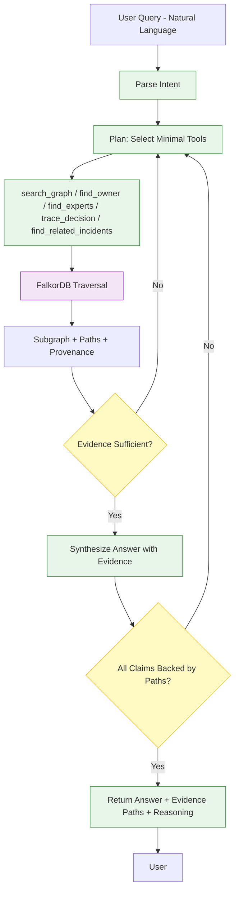

# agent-flow.md

**Status**: PRE-HACKATHON CONCEPTUAL DIAGRAM — NOT IMPLEMENTATION

**Notes**: Deliberate retrieval loop. Evidence-gated (must be sufficient + all claims backed by paths). No full graph dump.

