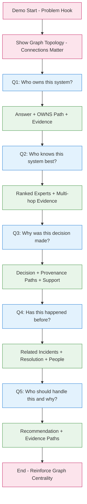

# demo-flow.md

**Status**: PRE-HACKATHON CONCEPTUAL DIAGRAM — NOT IMPLEMENTATION

```mermaid
flowchart TD
    Start[Demo Start - Problem Hook] --> Graph[Show Graph Topology - Connections Matter]
    Graph --> Q1[Q1: Who owns this system?]
    Q1 --> A1[Answer + OWNS Path + Evidence]
    A1 --> Q2[Q2: Who knows this system best?]
    Q2 --> A2[Ranked Experts + Multi-hop Evidence]
    A2 --> Q3[Q3: Why was this decision made?]
    Q3 --> A3[Decision + Provenance Paths + Support]
    A3 --> Q4[Q4: Has this happened before?]
    Q4 --> A4[Related Incidents + Resolution + People]
    A4 --> Q5[Q5: Who should handle this and why?]
    Q5 --> A5[Recommendation + Evidence Paths]
    A5 --> End[End - Reinforce Graph Centrality]
    
    classDef q fill:#e3f2fd,stroke:#1976d2
    classDef a fill:#e8f5e9,stroke:#388e3c
    classDef story fill:#fce4ec,stroke:#c2185b
    
    class Q1,Q2,Q3,Q4,Q5 q
    class A1,A2,A3,A4,A5 a
    class Start,Graph,End story
```

**Notes**: ~3 minutes. Must visibly show FalkorDB traversals produce answers with evidence paths.

