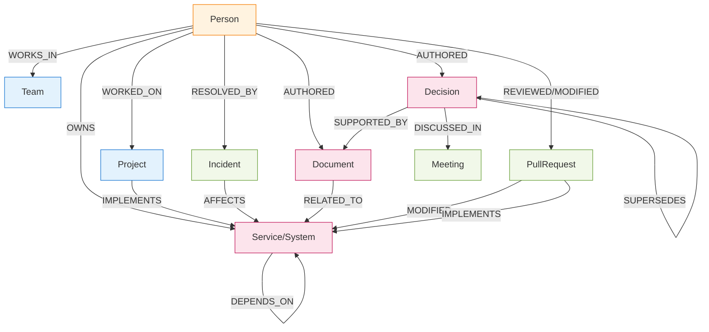

# graph-topology.md

**Status**: PRE-HACKATHON CONCEPTUAL DIAGRAM — NOT IMPLEMENTATION

**Notes**: 
- High-value paths cross entity types
- Provenance: Decision←SUPPORTED_BY→Document, Incident→AFFECTS→Service←OWNS→Person
- Expertise inferred via activity edges

